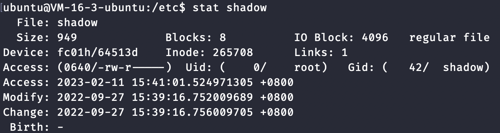

#### SET-UID 特权程序原理及攻击方法

##### 什么是特权程序？

Linux系统中密码储存在 */etc/shadow* 中， 用户修改密码后，密码会储存在这个文件中，但是这个文件只有 *root* 用户才有权限修改。



##### Linux 文件权限


开头 *-* 代表其类型为文件，否则此处为 *d*. 

*u* 为文件拥有者的权限，*g* 为文件所属组的权限，*o* 为其他用户的权限.

*Uid* 为用户拥有者的 *ID*, *Gid* 为文件所属组的 *ID*.


**那么一个普通用户应该怎么修改密码呢？**

在 *UNIX* 系统中提供一种 *password* 的程序，使得普通用户可以借助 *password* 程序来对 *shadow* 文件进行修改. 这种程序就是特权程序，其只能修改 *shadow* 文件，不允许修改其他文件.


特权程序一般分为两种类型：

- **守护进程**:  守护进程以 *root* 身份运行，它具有修改 *shadow* 文件的权限，当需要修改 *shadow* 文件时，可以向守护进程发送一个请求来实现，大多数操作系统都是通过这种方式，*windows* 中守护进程也被称为 **服务**.
- **SET-UID机制**: 它是通过一个比特位来标记程序，让操作系统区别对待它，在 *UNIX* 中使用较多.

##### 什么是 *SET-UID* 特权程序

*UNIX* 系统中一个进程，有三个用户 *ID*: 真实用户*ID*, 有效用户 *ID*,保留用户 *ID*.

- 真实用户 *ID*, 进程的真正拥有者，也即运行该进程的用户.
- 有效用户 *ID*, 进程访问控制中的使用的 *ID*, 表明进程所拥有的权限.
- 保留用户 *ID*, 待补充

对于一个非 *SET-UID* 的程序，当它以一个用户 *ID* 为 5000 执行时，其 真实用户 *ID* 和 有效用户 *ID* 都为 5000， 如果是一个*SET-UID* 程序，其真实用户 *ID* 仍为 5000， 但是其有效用户 *ID* 取决于其程序的拥有者，如果其拥有者为 *root*, 则其有效用户 *ID* 为 0， **这也就表明了，即使是一个普通用户执行的程序，也可能具有 root 用户的权限.**

##### SET-UID 程序示例

***chmod* 和 *chown*** , *chmod* 用于修改文件和文件夹的权限，*chown* 用于设置用户组.

```bash
# 复制id到当下文件夹，id程序可以查看运行进程的ID
cp /usr/bin/id ./myid
ls -l myid
#>> -rwxr-xr-x 1 ubuntu ubuntu 43224 Feb 11 19:39 myid
# 修改用户组
sudo chown root myid
#>> -rwxr-xr-x 1 root ubuntu 43224 Feb 11 19:39 myid
# 查看当前进程ID
./myid
#>> uid=500(ubuntu) gid=500(ubuntu) groups=500(ubuntu)...
sudo chmod 4755 myid
./myid
#>> uid=500(ubuntu) gid=500(ubuntu) euid=0(root) groups=500(ubuntu)...
# euid 为有效用户ID
```

*chmod* 修改文件权限，一般是使用三个数字表示不同用户或用户组的权限.

- 第一个数字表示文件所有者的权限
- 第二个数字表示与文件所有者同属一个用户组的其他用户的权限
- 第三个数字表示其它用户组的权限。

权限分为三种: 读(r=4)，写(w=2)，执行(x=1),综合起来还有可读可执行(rx=5=4+1),可读可写(rw=6=4+2),可读可写可执行(rwx=7=4+2+1).

*chmod 755* 设置用户的权限为:文件所有者可读可写可执行, 与文件所有者同属一个用户组的其他用户可读可执行, 其它用户组可读可执行.

*chmod 4755* 与 *chmod 755* 的区别在于开头多了一位，这个4表示其他用户执行文件时，具有与所有者相当的权限.

**使用cat来查看shadow文件:** 

```bash
cp /bin/cat ./mycat
sudo chown root mycat
sudo chmod 4755 mycat
# 查看 shadow 文件
./mycat /etc/shadow
#>> ubuntu:$1$SCVbTHlr$J1SYTNyCd//PfNC.6l/Az0:19262:0:99999:7:::
```

保存加密后的密码和用户的相关密码信息，每一行代表一个用户，每一行通过冒号`：`分为九个部分

1. 用户名
2. 加密后的密码
3. 上次修改密码的时间(从1970.1.1开始的总天数)
4. 两次修改密码间隔的最少天数，如果为0，则没有限制
5. 两次修改密码间隔最多的天数,表示该用户的密码会在多少天后过期，如果为99999则没有限制
6. 提前多少天警告用户密码将过期
7. 在密码过期之后多少天禁用此用户
8. 用户过期日期(从1970.1.1开始的总天数)，如果为0，则该用户永久可用
9. 保留

以上可知，加密后的密码为:  `$1$SCVbTHlr$J1SYTNyCd//PfNC.6l/Az0`, 加密的密码具有固定格式：`$id$salt$encrypted`

*id*表示加密算法，1代表`MD5`，5代表`SHA-256`，6代表`SHA-512`, 系统随机生成 *encrypted*表示密码的*hash*.


##### SET-UID 的安全性讨论

从原理上讲，*SET-UID* 程序是安全的，因为用户只能执行 *SET-UID* 程序中定义好的操作，用户的行为是受限的。但是，并未都是安全的，例如，`/bin/sh` 程序如果是 *SET-UID* 程序，则用户可以执行任何指定的命令，这是不安全的。


